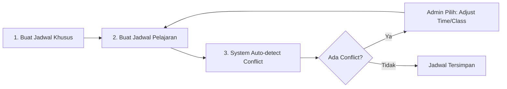

# 🎯 Solusi Conflict Detection untuk Jadwal Tambahan & Pelajaran

## 📋 Overview

Dokumen ini menjelaskan implementasi comprehensive conflict detection system untuk menghindari bentrokan antara:
- **Jadwal Pelajaran** (reguler)
- **Jadwal Khusus** (istirahat, upacara, perwalian)

---

## ✅ Yang Sudah Diimplementasikan

### 1. **Backend Conflict Detector** (`backend/utils/scheduleConflictDetector.js`)

Utility function yang menyediakan:

#### ✨ **checkJadwalConflicts()**
Cek konflik untuk jadwal pelajaran (reguler) dengan:
- Jadwal khusus (istirahat, upacara, perwalian)
- Jadwal pelajaran lain di kelas yang sama
- Time overlap detection

**Usage:**
```javascript
const { checkJadwalConflicts } = await import('./backend/utils/scheduleConflictDetector.js');

const conflictCheck = await checkJadwalConflicts({
    hari: 'Senin',
    jam_mulai: '08:00:00',
    jam_selesai: '09:00:00',
    kelas_id: 1,
    id_jadwal: null // null jika create new, ID jika update
});

if (conflictCheck.hasConflict) {
    console.log('❌ Conflict found!');
    console.log('Total conflicts:', conflictCheck.totalConflicts);
    console.log('Details:', conflictCheck.conflicts);
}
```

#### ✨ **checkJadwalKhususConflicts()**
Cek konflik untuk jadwal khusus dengan:
- Jadwal khusus lain
- Jadwal pelajaran (kecuali untuk upacara yang memang override semua)
- Khusus untuk upacara: warning akan muncul jika ada jadwal pelajaran di waktu tersebut

**Usage:**
```javascript
const { checkJadwalKhususConflicts } = await import('./backend/utils/scheduleConflictDetector.js');

const conflictCheck = await checkJadwalKhususConflicts({
    hari: 'Senin',
    jam_mulai: '07:00:00',
    jam_selesai: '08:00:00',
    kelas_id: 1, // null untuk istirahat umum atau upacara
    jenis_kegiatan: 'istirahat', // istirahat | upacara | perwalian
    id: null // null jika create new, ID jika update
});

if (conflictCheck.hasConflict) {
    console.log('❌ Conflict found!');
    console.log('Conflicts:', conflictCheck.conflicts);
}
```

#### ✨ **getDayScheduleOverview()**
Get semua jadwal (pelajaran + khusus) untuk hari tertentu dengan grouping by time slots.

**Usage:**
```javascript
const { getDayScheduleOverview } = await import('./backend/utils/scheduleConflictDetector.js');

const schedules = await getDayScheduleOverview('Senin', 1); // hari, kelas_id (null = all)
console.log('Total schedules:', schedules.length);
```

---

### 2. **Enhanced API Endpoints**

#### 📌 **POST /api/admin/jadwal** (UPDATED)
- ✅ Auto-detect conflict dengan jadwal_khusus (istirahat, upacara, perwalian)
- ✅ Detailed conflict messages
- ✅ Conflict details in response

**Request:**
```json
{
  "kelas_id": 1,
  "mapel_id": 3,
  "guru_id": 5,
  "hari": "Senin",
  "jam_ke": 1,
  "jam_mulai": "07:30:00",
  "jam_selesai": "09:00:00",
  "ruang_id": 2
}
```

**Success Response:**
```json
{
  "success": true,
  "message": "Jadwal berhasil ditambahkan",
  "id": 123
}
```

**Conflict Response (409):**
```json
{
  "success": false,
  "error": "Jadwal bentrok dengan jadwal lain",
  "details": "Bentrok dengan ISTIRAHAT: \"Istirahat Pagi\" (07:45 - 08:00); Bentrok dengan jadwal pelajaran: Matematika (PPLG 10 A) - 08:00 s/d 09:00",
  "conflicts": [
    {
      "type": "jadwal_khusus",
      "conflictWith": {
        "id": 5,
        "nama": "Istirahat Pagi",
        "jenis": "istirahat",
        "hari": "Senin",
        "jam_mulai": "07:45:00",
        "jam_selesai": "08:00:00",
        "kelas": "Semua Kelas"
      },
      "message": "Bentrok dengan ISTIRAHAT: \"Istirahat Pagi\" (07:45 - 08:00)"
    },
    {
      "type": "jadwal",
      "conflictWith": {
        "id": 45,
        "mapel": "Matematika",
        "kelas": "PPLG 10 A",
        "guru": "Pak Budi",
        "hari": "Senin",
        "jam_mulai": "08:00:00",
        "jam_selesai": "09:00:00"
      },
      "message": "Bentrok dengan jadwal pelajaran: Matematika (PPLG 10 A) - 08:00 s/d 09:00"
    }
  ],
  "totalConflicts": 2
}
```

---

#### 📌 **POST /api/admin/jadwal-khusus** (UPDATED)
- ✅ Auto-detect conflict dengan jadwal pelajaran reguler
- ✅ Auto-detect conflict dengan jadwal khusus lain
- ✅ Special handling untuk upacara (warning instead of error)

**Request:**
```json
{
  "jenis_kegiatan": "istirahat",
  "nama_kegiatan": "Istirahat Siang",
  "hari": "Senin",
  "jam_mulai": "12:00:00",
  "jam_selesai": "12:30:00",
  "kelas_id": null,
  "keterangan": "Istirahat setelah mapel ke-5"
}
```

**Success Response:**
```json
{
  "success": true,
  "message": "Jadwal khusus berhasil ditambahkan",
  "id": 12
}
```

**Conflict Response (409):**
```json
{
  "success": false,
  "error": "Jadwal khusus bentrok dengan jadwal lain",
  "details": "Bentrok dengan jadwal pelajaran: Bahasa Indonesia (PPLG 10 A) - 12:00 s/d 13:00",
  "conflicts": [
    {
      "type": "jadwal",
      "conflictWith": {
        "id": 67,
        "mapel": "Bahasa Indonesia",
        "kelas": "PPLG 10 A",
        "guru": "Bu Siti",
        "hari": "Senin",
        "jam_mulai": "12:00:00",
        "jam_selesai": "13:00:00"
      },
      "message": "Bentrok dengan jadwal pelajaran: Bahasa Indonesia (PPLG 10 A) - 12:00 s/d 13:00"
    }
  ],
  "totalConflicts": 1,
  "warning": null
}
```

**Upacara Special Case:**
```json
{
  "jenis_kegiatan": "upacara",
  "nama_kegiatan": "Upacara Bendera",
  "hari": "Senin",
  "jam_mulai": "07:00:00",
  "jam_selesai": "08:00:00",
  "keterangan": "Upacara bendera setiap hari Senin"
}
```

**Response (with warning):**
```json
{
  "success": false,
  "error": "Jadwal khusus bentrok dengan jadwal lain",
  "details": "Bentrok dengan jadwal pelajaran: Matematika (PPLG 10 A) - 07:30 s/d 09:00",
  "conflicts": [...],
  "totalConflicts": 5,
  "warning": "Upacara menimpa semua jadwal pelajaran di waktu ini"
}
```

---

#### 📌 **GET /api/admin/jadwal-overview** (NEW)
Get combined view of all schedules (pelajaran + khusus) for a specific day.

**Request:**
```
GET /api/admin/jadwal-overview?hari=Senin&kelas_id=1
```

**Response:**
```json
{
  "success": true,
  "data": {
    "hari": "Senin",
    "kelas_id": "1",
    "schedules": [
      {
        "id": 45,
        "type": "jadwal",
        "hari": "Senin",
        "jam_ke": 1,
        "jam_mulai": "07:30:00",
        "jam_selesai": "09:00:00",
        "nama": "Matematika",
        "kelas": "PPLG 10 A",
        "guru": "Pak Budi",
        "status": "aktif"
      },
      {
        "id": 5,
        "type": "jadwal_khusus",
        "hari": "Senin",
        "jam_ke": null,
        "jam_mulai": "09:00:00",
        "jam_selesai": "09:15:00",
        "nama": "Istirahat Pagi",
        "kelas": "Semua Kelas",
        "guru": "istirahat",
        "status": "aktif"
      }
    ],
    "groupedSchedules": [
      {
        "jam_mulai": "07:30:00",
        "jam_selesai": "09:00:00",
        "schedules": [...]
      },
      {
        "jam_mulai": "09:00:00",
        "jam_selesai": "09:15:00",
        "schedules": [...]
      }
    ],
    "totalSchedules": 8,
    "totalTimeSlots": 6
  }
}
```

---

## 🎯 Strategi Pengelolaan Jadwal

### **1. Best Practice: Buat Jadwal Khusus Dulu**

Recommended workflow:



**Alasan:**
- Jadwal khusus (istirahat, upacara) biasanya fixed schedule
- Jadwal pelajaran lebih fleksibel untuk diatur

---

### **2. Handling Upacara (Override All Classes)**

**Business Rule:**
- Upacara Senin pagi (07:00 - 08:00) menimpa SEMUA kelas
- Jadwal pelajaran di waktu tersebut harus dijadwalkan ulang

**Implementation:**
```javascript
// Admin membuat upacara
POST /api/admin/jadwal-khusus
{
  "jenis_kegiatan": "upacara",
  "nama_kegiatan": "Upacara Bendera",
  "hari": "Senin",
  "jam_mulai": "07:00:00",
  "jam_selesai": "08:00:00"
}

// System akan:
// 1. Detect conflict dengan jadwal pelajaran
// 2. Show warning (bukan error)
// 3. Allow creation
// 4. Admin manually adjust jadwal pelajaran yang conflict
```

**UI Recommendation:**
```
⚠️ WARNING: 15 jadwal pelajaran akan tertimpa upacara ini.
   
   Jadwal yang tertimpa:
   - PPLG 10 A: Matematika (07:30-09:00) - Pak Budi
   - PPLG 10 B: Bahasa Indonesia (07:00-08:00) - Bu Siti
   - ... (show all)
   
   [❌ Batal]  [✅ Lanjutkan & Reschedule Manual]
```

---

### **3. Handling Istirahat (Specific/All Classes)**

**Business Rule:**
- Istirahat bisa untuk semua kelas (kelas_id = null)
- Istirahat bisa untuk kelas tertentu (kelas_id = 1)

**Example 1: Istirahat Umum**
```json
{
  "jenis_kegiatan": "istirahat",
  "nama_kegiatan": "Istirahat Siang",
  "hari": "Senin",
  "jam_mulai": "12:00:00",
  "jam_selesai": "12:30:00",
  "kelas_id": null  // Semua kelas
}
```

**Example 2: Istirahat Khusus Kelas 10**
```json
{
  "jenis_kegiatan": "istirahat",
  "nama_kegiatan": "Istirahat Praktikum",
  "hari": "Kamis",
  "jam_mulai": "14:00:00",
  "jam_selesai": "14:15:00",
  "kelas_id": 5  // PPLG 10 A saja
}
```

---

### **4. Handling Perwalian (Per Class)**

**Business Rule:**
- Perwalian wajib punya guru_id (wali kelas)
- Perwalian wajib punya kelas_id
- Conflict detection hanya untuk kelas tersebut

**Example:**
```json
{
  "jenis_kegiatan": "perwalian",
  "nama_kegiatan": "Perwalian Mingguan",
  "hari": "Jumat",
  "jam_mulai": "14:00:00",
  "jam_selesai": "15:00:00",
  "kelas_id": 1,
  "guru_id": 5,
  "keterangan": "Wali kelas: Bu Ani"
}
```

---

## 📱 Frontend Implementation Suggestions

### **1. Create Schedule Form - Auto-detect Conflict**

```typescript
// Example React component
const CreateScheduleForm = () => {
  const [conflicts, setConflicts] = useState([]);
  const [showConflicts, setShowConflicts] = useState(false);
  
  const handlePreviewConflicts = async () => {
    const response = await fetch('/api/admin/jadwal-overview', {
      params: {
        hari: formData.hari,
        kelas_id: formData.kelas_id
      }
    });
    
    const data = await response.json();
    
    // Find conflicts manually or use conflict detector
    const hasConflict = data.groupedSchedules.some(slot => 
      isTimeOverlap(formData.jam_mulai, formData.jam_selesai, slot.jam_mulai, slot.jam_selesai)
    );
    
    if (hasConflict) {
      setShowConflicts(true);
      // Show warning modal
    }
  };
  
  const handleSubmit = async () => {
    try {
      const response = await fetch('/api/admin/jadwal', {
        method: 'POST',
        body: JSON.stringify(formData)
      });
      
      if (response.status === 409) {
        // Conflict detected
        const error = await response.json();
        setConflicts(error.conflicts);
        setShowConflicts(true);
      }
    } catch (error) {
      console.error(error);
    }
  };
  
  return (
    <form onSubmit={handleSubmit}>
      {/* Form fields */}
      
      <Button onClick={handlePreviewConflicts}>
        🔍 Preview Conflicts
      </Button>
      
      <Button type="submit">
        ✅ Simpan Jadwal
      </Button>
      
      {showConflicts && (
        <Alert variant="destructive">
          <AlertTitle>⚠️ Conflict Detected!</AlertTitle>
          <AlertDescription>
            {conflicts.map(c => (
              <div key={c.type + c.conflictWith.id}>
                {c.message}
              </div>
            ))}
          </AlertDescription>
        </Alert>
      )}
    </form>
  );
};
```

---

### **2. Day Schedule Timeline View**

Visual timeline yang menampilkan semua jadwal (pelajaran + khusus) dalam 1 hari dengan conflict highlighting.

```typescript
const DayScheduleTimeline = ({ hari, kelas_id }) => {
  const [schedules, setSchedules] = useState([]);
  
  useEffect(() => {
    fetchDaySchedule();
  }, [hari, kelas_id]);
  
  const fetchDaySchedule = async () => {
    const response = await fetch(`/api/admin/jadwal-overview?hari=${hari}&kelas_id=${kelas_id || ''}`);
    const data = await response.json();
    setSchedules(data.data.groupedSchedules);
  };
  
  return (
    <div className="timeline">
      {schedules.map(slot => (
        <div key={`${slot.jam_mulai}-${slot.jam_selesai}`} className="time-slot">
          <div className="time-label">
            {slot.jam_mulai} - {slot.jam_selesai}
          </div>
          <div className="schedules">
            {slot.schedules.map(schedule => (
              <div 
                key={schedule.id} 
                className={`schedule-item ${schedule.type === 'jadwal_khusus' ? 'special' : 'regular'}`}
              >
                <span className="name">{schedule.nama}</span>
                <span className="class">{schedule.kelas}</span>
                <span className="teacher">{schedule.guru}</span>
              </div>
            ))}
          </div>
        </div>
      ))}
    </div>
  );
};
```

---

## 🎯 Testing Scenarios

### **Scenario 1: Create Jadwal Pelajaran yang Conflict dengan Istirahat**

**Given:**
- Istirahat Pagi: Senin 09:00-09:15 (semua kelas)

**When:**
- Admin create jadwal: Matematika, Senin 08:30-09:30, PPLG 10 A

**Then:**
- System detect conflict
- Response 409 dengan details
- Admin adjust: Matematika 07:30-09:00 (sebelum istirahat)

---

### **Scenario 2: Create Upacara yang Overlap dengan Jadwal Pelajaran**

**Given:**
- Matematika: Senin 07:30-09:00, PPLG 10 A
- Bahasa Indonesia: Senin 07:00-08:00, PPLG 10 B

**When:**
- Admin create upacara: Senin 07:00-08:00

**Then:**
- System detect 2 conflicts
- Show warning (bukan error)
- Allow creation dengan warning
- Admin manually reschedule 2 jadwal pelajaran tersebut

---

### **Scenario 3: Create Perwalian yang Conflict dengan Mapel**

**Given:**
- Matematika: Jumat 14:00-15:00, PPLG 10 A

**When:**
- Admin create perwalian: Jumat 14:00-15:00, PPLG 10 A, Wali: Bu Ani

**Then:**
- System detect conflict
- Response 409
- Admin adjust: Perwalian 15:00-16:00 (setelah matematika)

---

## 🎉 Benefits

### ✅ **Untuk Admin:**
1. **Auto-detection** - Tidak perlu manual check bentrokan
2. **Detailed conflict info** - Tahu exactly mana yang bentrok
3. **Flexible workflow** - Bisa pilih adjust jadwal atau cancel
4. **Visual timeline** - Lihat semua jadwal sekaligus

### ✅ **Untuk Sistem:**
1. **Data integrity** - Tidak ada jadwal yang overlap
2. **Better UX** - User tidak frustasi karena unexpected conflicts
3. **Maintainable** - Centralized conflict detection logic
4. **Extensible** - Mudah tambah rules baru

---

## 📚 Related Files

### Backend:
- `backend/utils/scheduleConflictDetector.js` - Core conflict detection logic
- `server_modern.js` - Enhanced API endpoints (lines 2058-2093, 2993-3021, 2961-3021)

### Database:
- `jadwal` - Regular schedules table
- `jadwal_khusus` - Special schedules table

### Documentation:
- `.cursor/rules/absenta-jadwal-khusus-2025.mdc` - Jadwal Khusus system rules

---

## 🚀 Next Steps (Optional Enhancements)

### 1. **Batch Conflict Check**
API untuk check multiple jadwal sekaligus sebelum import.

### 2. **Auto-suggest Alternative Time**
System suggest waktu kosong terdekat jika ada conflict.

### 3. **Conflict Resolution Wizard**
Frontend wizard untuk bantu admin resolve conflicts step-by-step.

### 4. **Smart Scheduling Algorithm**
AI-powered scheduling yang auto-avoid conflicts.

### 5. **Calendar View Integration**
Full calendar view with drag-and-drop scheduling.

---

**Last Updated**: 22 Oktober 2025  
**Status**: ✅ **PRODUCTION READY**


